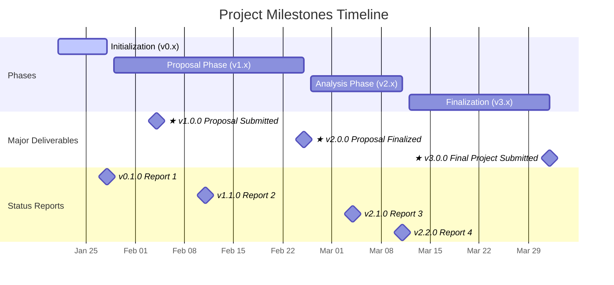

# Genomics Data Mining Project

## Project Overview

Project-based analysis of high-dimensional genomic data, focusing on data preprocessing, exploratory analysis, dimension reduction, statistical modeling, and reproducible research practices. Meant to demonstrate proficiency and mastery of core data science skills through iterative analysis. 

TODO: Mermaid chart: Research Question --> data --> preprocessing --> dimensional reduction --> predictive modeling --> interpretation

### Hypothesis

Small, reasonable changed is preprocessing and modeling choices can substantially alter downstream conclusions in high-dimensional gene expression analysis. 

"How many small, reasonable choices does it take to rewrite the data story?"

### Dataset

TODO: Finalize / pick one

NOTE: Everything is focused on the "meta hypothesis" (in the Hypothesis section) which we'll demonstrate with a particular dataset, and a "sub hypothesis" defined in each option below. 

Options:
- Option 1: Tumor vs Normal, gene expression profiles can reliably distinguish tumor samples from normal tissue (...and this separation is robust across reasonable preprocessing and modeling choices)
- Option 2: Cancer Subtype Classification, distinct molecular subtypes of cancer exhibit seperable gene expression patterns (...that can be detected using dimensional reduction and supervised modeling)
- Option 3: Survival, gene expression patterns are associated with patient survival outcomes (... and can be used to distinguish high-risk from low-risk groups)
- Option 4: Batch Effects, technical batch effects can dominate biological signal in high-dimmensional gene expression data
  - NOTE: This is a more technical option, not really about the biology itself
- Option 5: Predicting Treatmeant Response, pre-treatment gene expression profiles are predictive of response to a given therapy.

## Project Management

### Requirements Traceability

TODO: Mermaid chart rubric --> epics --> tasks --> evidence

- Rubric is defined by document _________, they are broken down into individual requirements (i.e., "Atomic Deliverables")
- Epics are the atomic deliverables. (TODO can we reference a project object like the Epic type here?) (i.e., GitHub Issues of Type Epic)
- Tasks break down epics into specific work that will be completed (i.e., GitHub Issues of Type Task)
- Evidence is the actual deliverable/reproducible output of the task (i.e., Repo Artifacts / Files / Documents / etc.)

### Milestones  |  Semantic Versioning

TODO: Insert mermaid chart ... I'm thinking the GitGraph, where the main should be major versions (with a tag for the major version number.... But, I think I would really like something that highlights two things: the major deliverables highlighted (also still showing the minor ones), and most importantly the dates (and because they are dates, they should kind of be reflective of how long each period is between expected deliverable). 

Milestone dates should be for 23:59 of that day (which should align with the end of an iteration). 

temp mermaid chart


### Iterationas

We will be using a weekly iteration, which starts on a Thursday 00:00 and ends on the Wednesday 23:59

TODO: Can we reference project iterations here? 

NOTE: Iterations apply to Tasks, not epics. 

## Tooling & Workflow

Language & Environment
- Python 3.x
- TODO: venv or conda for environment isolation
- TODO: requirements.txt or environment.yml
- Jupyter Notebooks
- Git + GitHub
- Mastery+
  - Makerfile / Task Runner
  - Deterministic environment locking
  - Script-based pipeline modules
  - CI (i.e., GitHub Actions)
  - Parameterized notebooks
  - Docker
  - Interactive Dashboard / app
  - Multi-omics integration

Repo Structure

```
/
├── README.md
├── requirements.txt
├── notebooks/
│   └── iteration_1.ipynb
├── data/
│   ├── raw/
│   └── processed/
└── docs/
```

TODO: Describe folders/files


