# Genomics Data Mining Project

## Project Overview

Project-based analysis of high-dimensional genomic data, focusing on data preprocessing, exploratory analysis, dimension reduction, statistical modeling, and reproducible research practices. Meant to demonstrate proficiency and mastery of core data science skills through iterative analysis.

```mermaid
---
config:
  theme: mc
  layout: dagre
title: 🗣️ Analyzing & Interpreting
---
flowchart LR
    Hypothesis["🧠
        Hypothesis"]
    Data["⛏️
        Data Mining"]
    Preprocessing["🧹
        Preprocessing"]
    Reduction["📦
        Dimensional Reduction"]
    Predictive["🤖
        Predictive Modeling"]

    Hypothesis --> Data
    Data --> Preprocessing
    Preprocessing --> Reduction
    Reduction --> Predictive
```



### 🧠 Hypothesis

Small, reasonable changes in preprocessing and modeling choices can substantially alter downstream conclusions in high-dimensional gene expression analysis.

"How many small, reasonable choices does it take to rewrite the data story?"

### ⛏️ Data Mining

> [!NOTE]
> These options are how we'll explore the lens of the "meta hypothesis" (see the Hypothesis section)

Options:

- Option 1: Tumor vs Normal, gene expression profiles can reliably distinguish tumor samples from normal tissue (...and this separation is robust across reasonable preprocessing and modeling choices)
- Option 2: Cancer Subtype Classification, distinct molecular subtypes of cancer exhibit seperable gene expression patterns (...that can be detected using dimensional reduction and supervised modeling)
- Option 3: Survival, gene expression patterns are associated with patient survival outcomes (... and can be used to distinguish high-risk from low-risk groups)
- Option 4: Batch Effects, technical batch effects can dominate biological signal in high-dimmensional gene expression data
  - NOTE: This is a more technical option, not really about the biology itself
- Option 5: Predicting Treatmeant Response, pre-treatment gene expression profiles are predictive of response to a given therapy.

### 🧹 Preprocessing

> [!CAUTION]
> TODO / Coming Soon...

### 📦 Dimensional Reduction

> [!CAUTION]
> TODO / Coming Soon...

### 🤖 Predictive Modeling

> [!CAUTION]
> TODO / Coming Soon...

## Project Management

Project Management will be done in our GitHub Project: [Genomics Data Mining Project Plan & Execution](https://github.com/users/anime4tw/projects/2)

### Requirements Traceability


This project follows an explicit requirements traceability model to ensure full coverage of the course evaluation rubric.

- The evaluation **Rubric** (as defined in the course syllabus) is the source of all requirements
- **Atomic Deliverables** represent single assessable requirements, decomposed from the Rubric
  - The authoritative list of Atomic Deliverables is maintained in  [docs/rubric_atomic_deliverables.csv](docs/rubric_atomic_deliverables.csv)
- **Epics** are Atomic Deliverables (there is a 1:1 relationship) implemented in GitHub as GitHub Issues. Custom field "Type" = ```Epic```
- **Tasks** break down Epics into concrete units of work completed during weekly iterations. Custom field "Type" = ```Task```
- **Evidence** consists of reproducible project artifacts (e.g., notebooks, data files, documentation, figures) produced by Tasks and stored in this repository

This traceability model ensures that all work can be mapped unambiguously from rubric → Epic → Task → Evidence.

### Milestones  |  Semantic Versioning


#### Phases

| Phase | Start Date | Start Time | End Date | End Time |
| ----- | ---------- | ---------- | -------- | -------- |
| Initialization | Thursday, January 22, 2026 | 00:00 | Wednesday, January 28, 2026 | 23:59 |
| Proposal | Thursday, January 29, 2026 | 00:00 | Wednesday, February 25, 2026 | 23:59 |
| Analysis | Thursday, February 26, 2026 | 00:00 | Wednesday, March 11, 2026 | 23:59 |
| Finalization | Thursday, March 12, 2026 | 00:00 | Wednesday, April 01, 2026 | 23:59 |

#### Milestones

A milestone is a point in time, which for us, is tied directly to a real deliverable/evidence. The **version** begins when the milestone has been reached. For example, v0.1 begins when Status Update 1 has been merged into the repo, until that point it would be v0.0.x.

| Milestone | Due Date | Due Time | Version |
| --------- | ------- | ---- | ---- |
| Status Update 1 | Wednesday, January 28, 2026 | 23:59 | v0.1 |
| Proposal Submitted | Wednesday, February 04, 2026 | 23:59 | v1 |
| Status Update 2 | Wednesday, February 11, 2026 | 23:59 | v1.1 |
| Proposal Finalized | Wednesday, February 25, 2026 | 23:59 | v2 |
| Status Update 3 | Wednesday, March 04, 2026 | 23:59 | v2.1 |
| Status Update 4 | Wednesday, March 11, 2026 | 23:59 | v2.2 |
| Final Project Submitted | Wednesday, April 01, 2026 | 23:59 | v3 |

The date-time represents when the version begins, and is always marked by the release of the specific milestone evidence.

### Iterations

Project work is organized into weekly plans, called Iterations. They are managed through our GitHub Project.

- Each iteration begins on Thursday at 00:00 and ends on Wednesday at 23:59
- Iterations apply to Tasks only

## Tooling & Workflow

### Language & Environment

> [!NOTE]
> Python and R are managed by Conda, see environment.yml for details

- **Python 3.x**
- **Conda**, for environment and dependency management (NOTE: Installed Anaconda Distribution, not Miniconda see [Getting started with conda](https://docs.conda.io/projects/conda/en/stable/user-guide/getting-started.html))
  - **Jupyter Notebooks**, for exploratory and analytical work
- **Git + GitHub**, for version control, and project management

The following are planned for upgrades/improvements if time allows:

- Makerfile / Task Runner
- Deterministic environment locking
- Script-based pipeline modules
- Continuous Integration (CI; i.e., GitHub Actions)
- Parameterized notebooks
- Docker
- Interactive Dashboard / app
- Multi-omics integration

### Repo Structure

> [!NOTE]
> Not all files/folders are listed here, only those that may be noteworthy to explore, or those that have specific meaning/importance to this repo (i.e., not easily Google-able)

```plain
/
├── data/                     # 
│   ├── processed/            # Cleaned, transformed, or derived datasets
│   └── raw/                  # Immutable raw data from the original source
├── docs/                     # Project documentation and governance artifacts
├── notebooks/                # Jupyter notebooks
├── src/                      # Lightweight helpers
├── environment.yml           # Python/Conda environment and dependency definitions
└── README.md                 # Overview document - great place to start
```

# This is added as part of a PR to demo during class